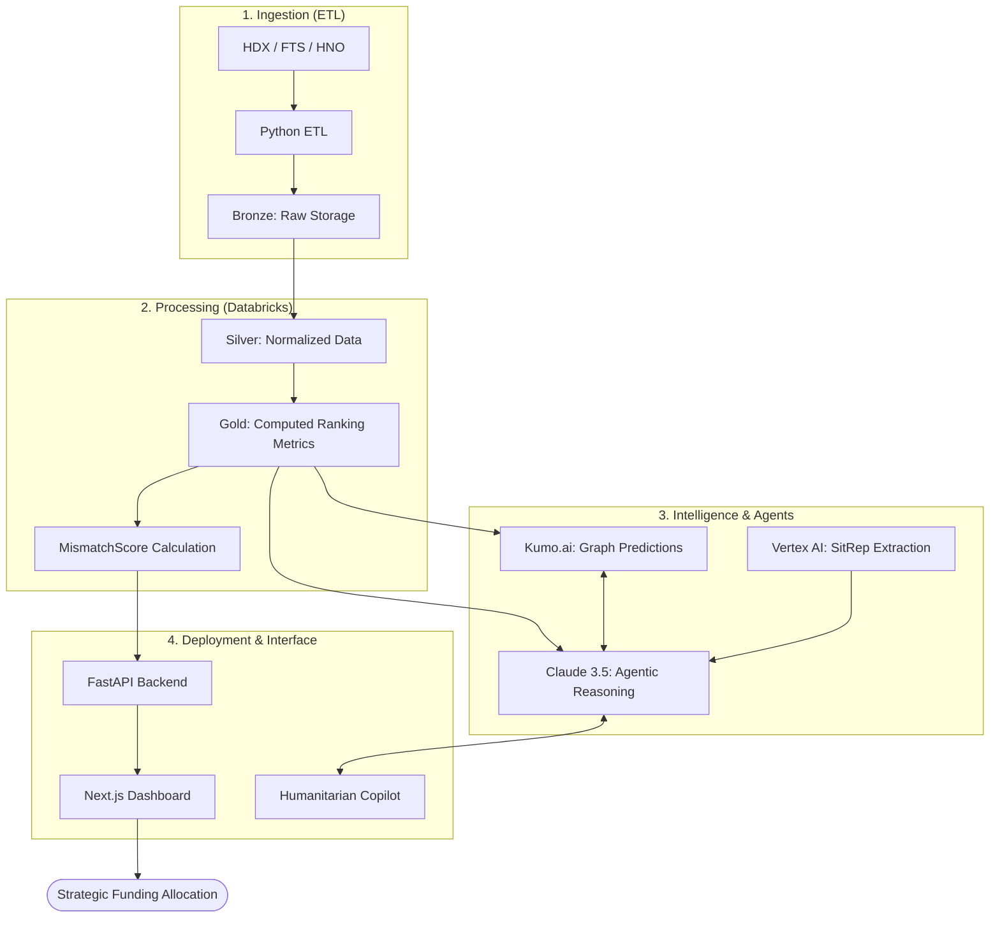

# Lighthouse OS: Intelligent Humanitarian Gap Analysis

> **"Turning Humanitarian Data into Defensible Action."**

Lighthouse OS is an end-to-end decision-support platform designed to answer a critical humanitarian question: **Which crises are receiving too little attention relative to their severity?**

By fusing large-scale data processing (Databricks), predictive graph intelligence (Kumo.ai), and conversational agentic workflows (Claude), we empower humanitarian coordinators to move from retrospective reporting to proactive, data-backed strategy.

---

## System Architecture

Our pipeline transforms raw, disparate humanitarian datasets into high-fidelity strategic insights.

---

## Key Features

### 1. The Neglect Index (Crisis Rankings)
A real-time ranking engine that prioritizes crises where the gap between severity (People in Need) and coverage (Funding Received) is widest. Adjusted for historical donor velocity and structural neglect.

### 2. Impact Simulator
A "What-If" sandbox for decision-makers. Users can simulate hypothetical funding pivots (e.g., *"Shift $10M to the Yemen Health Cluster"*) and forecast the human impact before a single dollar is pledged.

### 3. CERF Auto-Dossier (Powered by Claude)
Automates the weeks-long process of applying for the CERF Underfunded Emergencies window. With one click, Claude synthesizes Databricks metrics with unstructured SITREPs to generate a complete, defensible briefing memo.

### 4. Cross-Cluster Cascading Risk
Powered by **Kumo.ai**, our platform analyzes dependencies between sectors. It flags when a funding shortfall in one area (e.g., Protection) will create a catastrophic escalation in another (e.g., Health).

### 5. Data Health & "Data Humility"
A dedicated dashboard that monitors the freshness and completeness of the incoming humanitarian pipeline. We prioritize transparency, flagging operational blind spots rather than presenting "false precision."

---

## Technical Implementation

### **Backend & ETL**
- **Medallion Architecture:** Implemented in Databricks for reliable, multi-stage processing of HDX/HNO data.
- **FastAPI:** High-performance serving layer for ranking and timeline data.
- **MismatchScore Algorithm:** Proprietary calculation weighing population scale, severity indicators, and financial liquidity.

### **Predictive Layer (Kumo.ai)**
- Utilizes Graph Neural Networks to identify patterns in donor behavior and predict which crises are trending toward critical neglect before it happens.

### **Intelligence Layer (MCP & Claude)**
- **Model Context Protocol:** A custom gateway allowing Claude to safely interrogate live data.
- **Agentic Reasoning:** Claude handles complex logic like calculating "Liquidity Discounts" on slow-moving donor pledges.

---

## Vision
Lighthouse OS is built to support the **Humanitarian Principle of Impartiality**. By providing an objective, data-driven baseline for resource allocation, we help ensure that aid reaches those who need it most—regardless of media attention or political noise.
