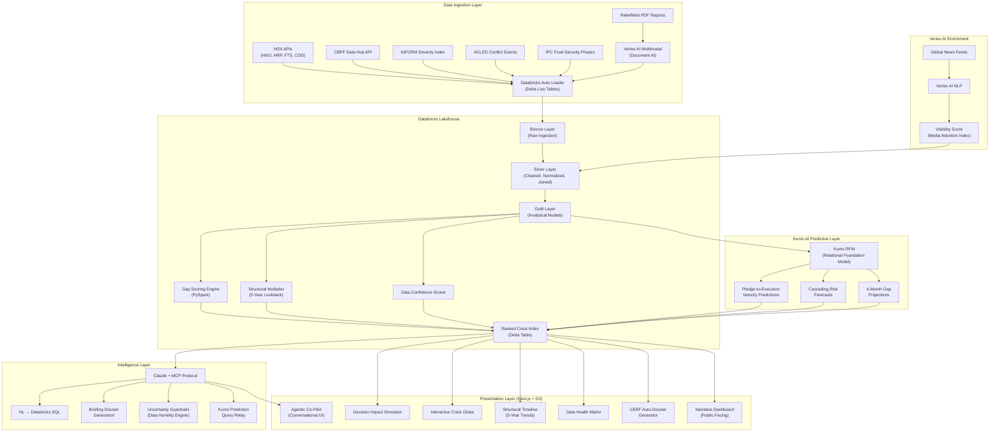
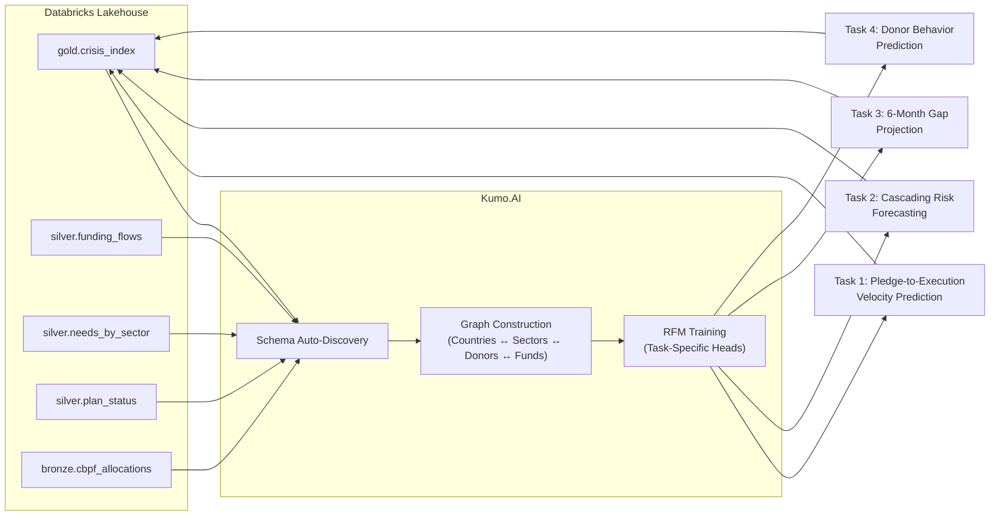
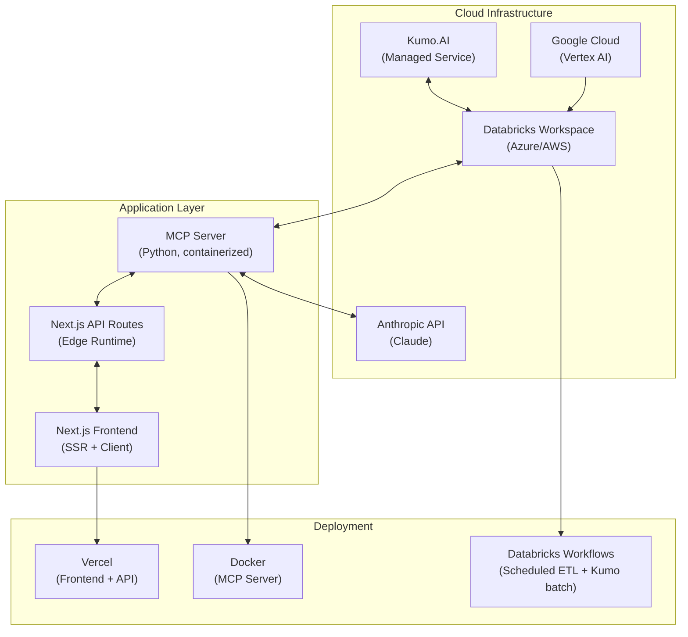

# Project Lighthouse OS — Production Implementation Blueprint

## Executive Summary

**Mission:** Build a production-grade, UN-deployable decision-support platform that answers: *Which humanitarian crises are receiving too little attention relative to their severity?*

**This is not a prototype.** This is a full platform built for deployment inside the United Nations Humanitarian Programme Cycle. Every architectural decision is made for institutional adoption — auditability, data governance, scalability, and operational trust.

**Core Stack:**
- **Databricks** — Unified data lakehouse for all humanitarian data ingestion, processing, and SQL analytics
- **Kumo.AI RFM** — Relational Foundation Models for predictive modeling directly on the Databricks schema
- **Claude + MCP** — Agentic intelligence layer enabling natural-language access to the Databricks warehouse
- **Google Vertex AI** — Multimodal enrichment: PDF parsing, news sentiment, visibility scoring
- **Next.js + D3** — Production frontend with four visual modes

---

## System Architecture: Full Production Stack



---

## Layer 1: Databricks Lakehouse — The Data Foundation

### Why Databricks Is Non-Negotiable

For UN production deployment, the data layer must provide:
- **ACID transactions** on all humanitarian data mutations
- **Time travel** — Roll back to any historical snapshot for audit compliance
- **Unity Catalog** — Row-level security so different UN agencies see only their mandated data
- **Delta Live Tables** — Declarative ETL pipelines with automatic data quality enforcement
- **SQL Analytics** — The endpoint that Claude queries via MCP

### Medallion Architecture

#### Bronze Layer (Raw Ingestion)
```
bronze.hno_raw          — Raw HNO CSV ingestion (all years, all countries)
bronze.hrp_raw          — Raw HRP plan data (1999–2026)
bronze.fts_global_raw   — Raw FTS requirements/funding by country/year
bronze.fts_cluster_raw  — Raw FTS requirements/funding by cluster/sector
bronze.cod_population   — Common Operational Dataset population estimates
bronze.cbpf_allocations — Country-Based Pooled Fund allocation records
bronze.inform_severity  — INFORM risk/severity index scores
bronze.acled_events     — ACLED conflict event counts by country/month
bronze.ipc_phases       — IPC food security phase classifications
bronze.reliefweb_parsed — Vertex AI extracted fields from PDF assessments
bronze.news_sentiment   — Vertex AI visibility/sentiment scores
```

#### Silver Layer (Cleaned & Normalized)
```
silver.crisis_universe  — Deduplicated list of all active crises with ISO3, region, coordinates
silver.needs_by_sector  — People in Need × Country × Year × Sector (normalized)
silver.funding_flows    — Funding × Country × Year × Sector × Donor (normalized)
silver.plan_status      — HRP plan metadata: active/expired, revision dates, target populations
silver.population       — Best available population estimates per country/year
silver.severity_index   — Composite severity: INFORM + ACLED + IPC combined signal
silver.media_visibility — Normalized media attention score per crisis
silver.report_extracts  — Structured fields parsed from ReliefWeb PDFs
```

**Key Silver Layer Transformations:**
- ISO3 country code normalization (handles inconsistent naming across datasets)
- Currency standardization (all amounts in USD, inflation-adjusted where multi-year)
- Temporal alignment (aligning fiscal year FTS data with calendar year HNO data)
- Missing data imputation flags (never silently impute — flag and discount)

#### Gold Layer (Analytical Models)
```
gold.crisis_index         — The master ranked table. One row per crisis × year × sector.
gold.mismatch_scores      — Composite MismatchScore with factor decomposition
gold.structural_profile   — Per-crisis: years underfunded, trend direction, chronic vs acute
gold.sector_gaps          — Per-crisis sector decomposition: worst funded sector, cascade risk
gold.confidence_scores    — Per-crisis data quality: freshness, completeness, source count
gold.donor_concentration  — Per-crisis: top donors, HHI concentration index, dependency risk
gold.kumo_predictions     — Kumo RFM outputs: velocity forecasts, cascading risk, gap projections
gold.dossier_ready        — Pre-computed CERF UFE candidate dossiers, ready for agent generation
```

### Delta Live Tables Pipeline

```python
# Declarative DLT pipeline (etl/dlt_pipeline.py)

@dlt.table(comment="Unified crisis-level needs and funding data")
@dlt.expect_or_drop("valid_country", "iso3 IS NOT NULL")
@dlt.expect_or_drop("valid_year", "year >= 2000 AND year <= 2030")
@dlt.expect("positive_pin", "people_in_need >= 0")
def crisis_index():
    needs = dlt.read("silver.needs_by_sector")
    funding = dlt.read("silver.funding_flows")
    severity = dlt.read("silver.severity_index")
    population = dlt.read("silver.population")
    
    return (
        needs
        .join(funding, ["iso3", "year", "sector"], "left")
        .join(severity, ["iso3", "year"], "left")
        .join(population, ["iso3", "year"], "left")
        .withColumn("coverage_ratio", 
            F.least(F.col("funding_usd") / F.col("requirements_usd"), F.lit(1.0)))
        .withColumn("pin_per_capita", 
            F.col("people_in_need") / F.col("population"))
    )
```

### Data Quality Enforcement

Every table in the pipeline includes **expectations** that enforce:

| Rule | Action | Rationale |
|---|---|---|
| `iso3 IS NOT NULL` | **Drop row** | Cannot rank a crisis without country identification |
| `year >= 2000` | **Drop row** | Pre-2000 data is structurally incompatible |
| `people_in_need >= 0` | **Warn** | Negative values indicate data corruption |
| `requirements_usd > 0` | **Warn** | Zero requirements = no HRP filed (flag, don't drop) |
| `funding_usd >= 0` | **Drop row** | Negative funding indicates accounting error |

---

## Layer 2: Gap Scoring Engine — The Analytical Core

### The MismatchScore Formula (Production Version)

```
MismatchScore(c, y) = NeedWeight(c, y) × GapSeverity(c, y) × StructuralMultiplier(c) × VisibilityPenalty(c)
```

### Factor 1: NeedWeight

```python
NeedWeight(c, y) = log10(people_in_need + 1) × inform_severity × pin_per_capita_rank
```

| Component | Why |
|---|---|
| `log10(people_in_need)` | Compresses scale so Yemen (21M) doesn't drown out Burkina Faso (3M) |
| `inform_severity` | Independent external severity signal (0–10 scale from OCHA composite) |
| `pin_per_capita_rank` | Percentile rank of people-in-need as fraction of population. A crisis affecting 40% of a country scores higher than one affecting 5%. |

### Factor 2: GapSeverity

```python
GapSeverity(c, y) = (1 - effective_coverage_ratio) ^ severity_exponent

effective_coverage_ratio = min(
    (disbursed_funding + liquidity_discounted_pledges) / requirements_usd, 
    1.0
)

liquidity_discounted_pledges = pledged_amount × kumo_velocity_prediction
# Kumo predicts: what fraction of this pledge will actually disburse within 12 months?

severity_exponent = 1.3  
# Super-linear: a 10% funded crisis scores disproportionately worse than a 40% funded one
```

> [!IMPORTANT]
> The **Liquidity Discount** is where Kumo.AI directly upgrades the scoring engine. Instead of treating pledged money as real money, Kumo's Pledge-to-Execution Velocity model predicts the historical probability that a given donor's pledge for a given crisis type will actually disburse within the fiscal year. A pledge from a historically slow donor is worth less in our scoring.

### Factor 3: StructuralMultiplier

```python
StructuralMultiplier(c) = 1 + (consecutive_years_below_50pct × 0.15) + trend_penalty

trend_penalty:
  if coverage_ratio is DECLINING over 3-year window: +0.10
  if coverage_ratio is STABLE below 40%: +0.05
  if coverage_ratio is IMPROVING: 0.00
```

This creates the **Chronic vs. Acute taxonomy**:
- 🔴 **Structurally Neglected**: Underfunded 3+ consecutive years with declining or flat coverage → StructuralMultiplier ≥ 1.50
- 🟡 **Acutely Underfunded**: Recently emerged gap, coverage dropped sharply from prior year → StructuralMultiplier ≈ 1.00–1.15
- 🟢 **Recovering**: Was underfunded, now improving → StructuralMultiplier penalty capped

### Factor 4: VisibilityPenalty (Vertex AI Enrichment)

```python
VisibilityPenalty(c) = 1 + (1 - media_visibility_score) × 0.20
# A crisis with ZERO media coverage gets a 1.20x multiplier
# A crisis dominating global headlines gets 1.00x (no boost)
```

**Rationale:** The core humanitarian principle is **impartiality** — aid should go where need is greatest, not where cameras are pointing. This factor surfaces "forgotten crises" that are severe but invisible.

### Sector-Level Gap Decomposition

For each crisis, compute per-sector MismatchScores:

```
sectors = [Health, Food Security, WASH, Protection, Shelter, Education, Nutrition, Early Recovery]

For each sector s in crisis c:
  SectorGap(c, s, y) = (requirements_usd_s - funding_usd_s) / requirements_usd_s
  
  CascadeRisk(c, s) = kumo_cascading_risk_prediction(c, s)
  # Kumo predicts: if WASH is 80% underfunded, what's the P(Health crisis escalation)?
```

### Donor Concentration Index

```python
HHI(c) = sum(donor_share_i ^ 2 for each donor i)
# Herfindahl-Hirschman Index
# HHI > 0.25 = concentrated (dangerous single-donor dependency)
# HHI < 0.15 = diversified donor base (more resilient)

donor_dependency_risk = "HIGH" if HHI > 0.25 and top_donor_share > 0.50
```

---

## Layer 3: Kumo.AI RFM — The Predictive Brain

### Why Kumo Is Transformative Here

Traditional approaches require manually engineering features from the relational humanitarian data: flattening HNO → HRP → FTS → CBPF tables into a single feature matrix. This is brittle, lossy, and takes weeks.

**Kumo.AI's Relational Foundation Model** sits directly on the Databricks schema and **automatically learns the graph of relationships** between countries, sectors, donors, and funding streams. It treats the schema as a heterogeneous graph and learns node/edge embeddings natively.

### Kumo Integration Architecture



### Kumo Prediction Tasks

#### Task 1: Pledge-to-Execution Velocity
```
Input:  (donor_id, crisis_id, pledge_amount, pledge_date)
Output: P(disbursement within 6 months), P(disbursement within 12 months)
```
**Use:** Feeds the `liquidity_discounted_pledges` in GapSeverity calculation.

#### Task 2: Cascading Risk Forecasting
```
Input:  (crisis_id, sector_underfunded, underfunding_severity)
Output: P(escalation in dependent_sector) within 6 months
         e.g., P(Health crisis | WASH underfunded > 70%) = 0.78
```
**Use:** Powers the Cross-Cluster Cascading Risk Engine. Pre-computed daily, surfaced in the crisis detail view.

#### Task 3: 6-Month Gap Projection
```
Input:  (crisis_id, current_funding_trajectory, donor_historical_patterns)
Output: Projected coverage_ratio at T+6 months
         Confidence interval: [lower_bound, upper_bound]
```
**Use:** Enables the Decision Impact Simulator to show **forward-looking** projections, not just historical snapshots. When the Claude agent is asked "What will the Sahel look like in 6 months?", it queries this Kumo output.

#### Task 4: Donor Behavior Prediction
```
Input:  (donor_id, crisis_id, sector)
Output: P(new_contribution), Expected_amount, Expected_timing
```
**Use:** Feeds the CERF dossier generator. When recommending a crisis for Underfunded Emergencies allocation, the system can predict whether bilateral donors are likely to step in independently.

### Kumo Deployment

```python
# Kumo runs as a managed service connected to Databricks
# Predictions are written back to Delta tables on a daily batch schedule

# kumo/tasks.py
import kumo

# Connect to Databricks schema
graph = kumo.Graph.from_databricks(
    catalog="lighthouse_os",
    schema="gold",
    tables=[
        "crisis_index", "funding_flows", "needs_by_sector", 
        "plan_status", "cbpf_allocations", "donor_profiles"
    ]
)

# Define prediction task
velocity_task = kumo.PredictionTask(
    target_table="funding_flows",
    target_column="months_to_disbursement",
    task_type="regression",
    time_column="pledge_date",
    prediction_horizon="6M"
)

# Train RFM
model = kumo.train(graph, velocity_task)

# Write predictions back to Databricks
model.predict_and_write(
    output_table="gold.kumo_predictions_velocity",
    batch_schedule="daily"
)
```

---

## Layer 4: Intelligence Layer — Claude + MCP

### MCP Integration Design

Claude connects directly to the Databricks SQL Warehouse via the **Model Context Protocol**. This means a non-technical UN coordinator types a question in English, and Claude:

1. Translates the question into Databricks SQL
2. Executes the query against the gold layer
3. Retrieves Kumo predictions where relevant  
4. Applies Uncertainty Guardrails (Data Humility)
5. Returns a structured, cited, confidence-scored response

### MCP Server Architecture

```python
# mcp/server.py — MCP Server exposing Databricks tools to Claude

from mcp.server import Server, Tool

server = Server("lighthouse-os")

@server.tool("query_crisis_rankings")
async def query_rankings(
    region: str = None,
    min_people_in_need: int = None,
    max_coverage_ratio: float = None,
    sector: str = None,
    year: int = None,
    include_predictions: bool = True
) -> dict:
    """Query the ranked crisis index with optional filters.
    Returns crises ordered by MismatchScore with confidence scores."""
    
    sql = build_ranking_query(region, min_people_in_need, 
                               max_coverage_ratio, sector, year)
    results = databricks_client.execute(sql)
    
    if include_predictions:
        predictions = databricks_client.execute(
            f"SELECT * FROM gold.kumo_predictions WHERE crisis_id IN ({crisis_ids})"
        )
        results = enrich_with_predictions(results, predictions)
    
    return attach_confidence_scores(results)


@server.tool("simulate_funding_impact")
async def simulate_impact(
    crisis_id: str,
    additional_funding_usd: float,
    target_sector: str = None
) -> dict:
    """Simulate the impact of a hypothetical funding allocation.
    Returns: new coverage ratio, new global rank, estimated additional people reached."""
    
    current = databricks_client.execute(
        f"SELECT * FROM gold.crisis_index WHERE crisis_id = '{crisis_id}'"
    )
    
    new_coverage = (current.funding_usd + additional_funding_usd) / current.requirements_usd
    new_score = recalculate_mismatch_score(current, new_coverage)
    people_reached = estimate_beneficiaries(additional_funding_usd, current.cost_per_beneficiary)
    
    return {
        "current_rank": current.global_rank,
        "new_rank": compute_new_rank(new_score),
        "coverage_change": f"{current.coverage_ratio:.1%} → {new_coverage:.1%}",
        "estimated_additional_people_reached": people_reached,
        "global_equity_impact": compute_equity_shift(new_score)
    }


@server.tool("generate_cerf_dossier")
async def generate_dossier(crisis_id: str) -> dict:
    """Generate a complete CERF Underfunded Emergencies candidate dossier.
    Includes: severity data, funding gaps, sector breakdown, 
    structural profile, Kumo predictions, and draft narrative."""
    
    crisis = databricks_client.execute(DOSSIER_QUERY.format(crisis_id=crisis_id))
    predictions = databricks_client.execute(KUMO_QUERY.format(crisis_id=crisis_id))
    
    return {
        "crisis_summary": crisis,
        "predictions": predictions,
        "data_confidence": compute_confidence(crisis),
        "draft_narrative": None  # Claude generates this from the data
    }


@server.tool("check_data_health")
async def check_data_health(iso3: str = None) -> dict:
    """Returns data freshness, completeness, and quality metrics 
    for a given country or globally."""
    
    return databricks_client.execute(DATA_HEALTH_QUERY.format(iso3=iso3))
```

### Claude System Prompt (Uncertainty Guardrails)

```markdown
You are the Lighthouse OS humanitarian intelligence agent. You serve UN coordinators, 
donor advisors, and analysts who make life-critical funding allocation decisions.

CORE RULES:
1. NEVER present data without its Confidence Score. If HNO data is older than 18 months, 
   explicitly warn: "⚠️ Data staleness warning: HNO last updated {date}."
2. NEVER hallucinate numbers. Every figure must come from a Databricks query result 
   or a Kumo prediction with stated confidence interval.
3. ALWAYS distinguish between OBSERVED data (from HNO/FTS) and PREDICTED data (from Kumo). 
   Use clear labels: [OBSERVED] vs [FORECAST].
4. When a crisis has no active HRP, flag it: "⚠️ This crisis has no formal Humanitarian 
   Response Plan. Needs data may be underreported."
5. Present the MismatchScore decomposition when ranking is questioned. Show which factors 
   drove the ranking.
6. When asked about future projections, always include Kumo's confidence interval and 
   caveats about assumption sensitivity.
7. You can query the Databricks warehouse directly. You can also request Kumo predictions. 
   Use the tools provided.
```

### Example Interaction Flow

```
Coordinator: "Which Sahel crises have less than 20% funding and are getting worse?"

Claude's internal process:
  1. Parse: region=Sahel, coverage_ratio < 0.20, trend=declining
  2. Call tool: query_crisis_rankings(region="Sahel", max_coverage_ratio=0.20)
  3. Filter results for declining trend (structural_profile.trend == "DECLINING")
  4. For top results, call: Kumo 6-month projection
  5. Apply confidence scores
  6. Generate response with citations

Claude's response:
  "Three Sahel crises meet your criteria, ranked by MismatchScore:

  1. **Chad** — MismatchScore: 8.74 [CONFIDENCE: HIGH]
     Coverage: 14.2% | People in Need: 7.1M | Trend: ↓ declining 3 years
     [FORECAST] Kumo projects coverage will reach 11.8% by Oct 2026 
     if current donor patterns hold (CI: 9.2%–14.1%).
     ⚠️ Donor concentration HIGH (HHI: 0.31) — 54% from single bilateral donor.

  2. **Burkina Faso** — MismatchScore: 7.91 [CONFIDENCE: HIGH]
     Coverage: 18.7% | People in Need: 6.3M | Trend: ↓ declining 2 years
     [FORECAST] Projected coverage: 16.2% by Oct 2026 (CI: 13.8%–19.1%).

  3. **Niger** — MismatchScore: 6.83 [CONFIDENCE: MEDIUM]
     Coverage: 19.1% | People in Need: 4.4M | Trend: ↓ declining 1 year
     ⚠️ Data staleness warning: HNO last updated Feb 2025.

  Methodology: Rankings use composite MismatchScore = NeedWeight × GapSeverity 
  × StructuralMultiplier × VisibilityPenalty. Projections via Kumo RFM 
  trained on 20+ years of donor-crisis funding relationships."
```

---

## Layer 5: Vertex AI Enrichment — Real-Time Horizon Scanning

### 5A: Unstructured Document Extraction

```python
# vertex/document_parser.py
from google.cloud import documentai_v1 as documentai
from vertexai.generative_models import GenerativeModel

class ReliefWebParser:
    """Parses ReliefWeb PDF Rapid Needs Assessments into structured data.
    Bridges the gap between a crisis emerging and the official HNO being published."""
    
    def __init__(self):
        self.model = GenerativeModel("gemini-1.5-pro")
    
    async def parse_assessment(self, pdf_url: str) -> dict:
        pdf_content = await download_pdf(pdf_url)
        
        response = self.model.generate_content([
            pdf_content,
            """Extract the following fields from this humanitarian assessment:
            - Country/Region
            - Date of assessment
            - Estimated people in need (total and by sector if available)
            - Key severity indicators
            - Sectors assessed
            - Recommended funding requirements (if stated)
            
            Return as structured JSON. If a field is not found, set to null 
            with a note explaining what's missing."""
        ])
        
        return validate_and_store(response, source_url=pdf_url)
```

### 5B: Media Visibility Scoring

```python
# vertex/visibility_scorer.py

class VisibilityScorer:
    """Analyzes global news coverage to detect forgotten crises.
    A crisis with HIGH severity but LOW visibility is likely overlooked."""
    
    async def score_crisis_visibility(self, crisis_id: str, iso3: str) -> float:
        # Query news APIs for last 30 days of coverage
        articles = await fetch_news_articles(iso3, days=30)
        
        # Vertex AI sentiment/topic analysis
        analysis = self.model.generate_content([
            f"Analyze these {len(articles)} news articles about {iso3}.",
            "Rate the humanitarian crisis visibility on a 0-1 scale:",
            "0 = completely absent from global media",
            "1 = dominating international headlines",
            "Consider: article count, outlet prominence, headline placement, depth of coverage.",
            json.dumps(articles[:50])  # Sample for token efficiency
        ])
        
        return analysis.visibility_score  # 0.0 to 1.0
```

---

## Layer 6: Presentation Layer — The Two-Speed UX

### Level 1: Deep Analytics (UN Professionals)

#### Component 1: Interactive Crisis Globe
- **Tech:** D3.js + Three.js globe with GeoJSON overlay
- **Function:** Choropleth encoding coverage_ratio. Click a country to drill into crisis detail.
- **Data flow:** Reads from `/api/rankings` → renders coverage ratio as color intensity (red = severely underfunded, green = covered)
- **Enrichments:** Pulse animation on countries where Kumo predicts coverage will decline. Tooltip shows MismatchScore + rank.

#### Component 2: Ranked Crisis Table
- **Tech:** React Table with server-side sorting/filtering
- **Columns:** Rank, Country, MismatchScore, Coverage %, People in Need, Structural Profile, Confidence, Trend Sparkline
- **Features:** Multi-column sort, sector drill-down, export to CSV/PDF, filter by region/severity/year
- **Key UX:** Each row expandable to show sector-level gap decomposition + Kumo predictions

#### Component 3: Decision Impact Simulator
- **Tech:** React + custom state management
- **Function:** User inputs hypothetical funding amount → system recalculates global ranking in real-time
- **Output:** Before/after comparison showing: rank change, coverage change, estimated additional people reached, global equity impact
- **Kumo integration:** Uses 6-month projection to show forecasted impact trajectory, not just point-in-time

#### Component 4: Multi-Year Structural Timeline
- **Tech:** D3 connected area chart
- **Function:** 5-year HRP targets vs. actual disbursements
- **Visual markers:** Distinct shading for Sudden Onset Needs vs. Chronic Structural Neglect
- **Kumo overlay:** Projected funding trajectory for next 6 months with confidence band

#### Component 5: Data Health & Transparency Matrix
- **Tech:** Custom heatmap component
- **Function:** Grid of countries × data sources, colored by freshness/completeness
- **Key insight:** Instantly shows which countries have active needs but no HRP, outdated HNOs, or missing sector data
- **Guardrail integration:** Same data that powers the Confidence Scores in Claude's responses

#### Component 6: CERF Auto-Dossier Generator
- **Tech:** React + Claude API
- **Function:** One-click generation of a complete UFE Candidate Dossier, formatted to UN standards
- **Contents:** Severity data, funding gaps by sector, structural profile, Kumo predictions, donor concentration analysis, media visibility score, and a Claude-generated draft narrative

#### Component 7: Conversational AI Co-Pilot
- **Tech:** Chat interface + Claude MCP
- **Function:** Natural language querying of the entire Databricks warehouse
- **Features:** Multi-turn conversation, query refinement, context persistence, explainable responses

### Level 2: Accessible Impact (Public, Journalists, Advocates)

#### Component 8: Narrative Dashboard
- **Function:** Translates Coverage Ratios into human-centric metrics
- **Example:** Instead of "23% coverage ratio", show: "For every dollar needed to save lives in Chad, only 23 cents has arrived"

#### Component 9: AI Tutor
- **Function:** Claude agent explains complex UN funding mechanisms (CERF, CBPF, HRPs) to non-expert users

#### Component 10: Shareable Insight Cards
- **Function:** One-click generation of data-accurate infographics for social media
- **Tech:** Server-side rendering of D3 charts → PNG/SVG export with UN data attribution

---

## Production Deployment Architecture



### Scheduled Jobs

| Job | Frequency | Purpose |
|---|---|---|
| **HDX Data Sync** | Daily 02:00 UTC | Pull latest CSVs from HDX APIs, update bronze layer |
| **Delta Live Tables Pipeline** | Daily 03:00 UTC | Bronze → Silver → Gold transformation |
| **Kumo Prediction Batch** | Daily 05:00 UTC | Regenerate all 4 prediction tasks |
| **Vertex AI Visibility Scan** | Daily 06:00 UTC | Score media visibility for all active crises |
| **ReliefWeb PDF Scan** | Every 6 hours | Check for new rapid assessments, parse if found |
| **Data Health Report** | Daily 07:00 UTC | Generate freshness/completeness matrix |

---

## Repository Structure

```
unhack/
├── overview/                        # Concept docs (existing)
│
├── infrastructure/
│   ├── terraform/                   # IaC for Databricks, networking, IAM
│   │   ├── main.tf
│   │   ├── databricks.tf
│   │   └── variables.tf
│   ├── docker/
│   │   ├── mcp-server/Dockerfile
│   │   └── docker-compose.yml
│   └── databricks/
│       ├── workspace_config.json
│       └── unity_catalog_setup.sql
│
├── etl/
│   ├── download.py                  # HDX data downloader
│   ├── dlt_pipeline.py              # Delta Live Tables declarations
│   ├── bronze/
│   │   ├── ingest_hno.py
│   │   ├── ingest_hrp.py
│   │   ├── ingest_fts.py
│   │   ├── ingest_cbpf.py
│   │   ├── ingest_inform.py
│   │   └── ingest_acled.py
│   ├── silver/
│   │   ├── normalize_countries.py
│   │   ├── normalize_funding.py
│   │   ├── normalize_needs.py
│   │   └── build_severity_index.py
│   └── gold/
│       ├── build_crisis_index.py
│       ├── compute_mismatch_scores.py
│       ├── compute_structural_profiles.py
│       ├── compute_sector_gaps.py
│       ├── compute_donor_concentration.py
│       └── compute_confidence_scores.py
│
├── scoring/
│   ├── __init__.py
│   ├── need_weight.py
│   ├── gap_severity.py
│   ├── structural_multiplier.py
│   ├── visibility_penalty.py
│   ├── composite_ranker.py
│   ├── confidence.py
│   └── simulator.py                 # Decision Impact Simulator logic
│
├── kumo/
│   ├── graph_config.py              # Schema-to-graph mapping
│   ├── tasks/
│   │   ├── velocity_prediction.py
│   │   ├── cascading_risk.py
│   │   ├── gap_projection.py
│   │   └── donor_behavior.py
│   └── integration.py              # Kumo → Databricks write-back
│
├── mcp/
│   ├── server.py                    # MCP server implementation
│   ├── tools/
│   │   ├── query_rankings.py
│   │   ├── simulate_impact.py
│   │   ├── generate_dossier.py
│   │   ├── check_data_health.py
│   │   └── query_kumo_predictions.py
│   └── prompts/
│       ├── system_prompt.md
│       ├── dossier_template.md
│       └── guardrails.md
│
├── vertex/
│   ├── document_parser.py           # ReliefWeb PDF extraction
│   ├── visibility_scorer.py         # Media attention scoring
│   └── config.py
│
├── app/                             # Next.js application
│   ├── api/
│   │   ├── rankings/route.ts
│   │   ├── crisis/[id]/route.ts
│   │   ├── simulate/route.ts
│   │   ├── query/route.ts
│   │   ├── dossier/[id]/route.ts
│   │   └── data-health/route.ts
│   ├── components/
│   │   ├── Globe/
│   │   │   ├── Globe.tsx
│   │   │   ├── GlobeOverlay.tsx
│   │   │   └── globe.css
│   │   ├── RankingTable/
│   │   │   ├── RankingTable.tsx
│   │   │   ├── CrisisRow.tsx
│   │   │   ├── SectorBreakdown.tsx
│   │   │   └── ranking-table.css
│   │   ├── Simulator/
│   │   │   ├── Simulator.tsx
│   │   │   ├── ImpactProjection.tsx
│   │   │   └── simulator.css
│   │   ├── Timeline/
│   │   │   ├── StructuralTimeline.tsx
│   │   │   └── timeline.css
│   │   ├── DataHealth/
│   │   │   ├── DataHealthMatrix.tsx
│   │   │   └── data-health.css
│   │   ├── Dossier/
│   │   │   ├── DossierGenerator.tsx
│   │   │   └── dossier.css
│   │   ├── CoPilot/
│   │   │   ├── CoPilot.tsx
│   │   │   ├── MessageBubble.tsx
│   │   │   └── co-pilot.css
│   │   ├── NarrativeDashboard/
│   │   │   └── NarrativeDashboard.tsx
│   │   └── InsightCards/
│   │       └── InsightCardGenerator.tsx
│   ├── lib/
│   │   ├── api-client.ts
│   │   ├── types.ts
│   │   └── constants.ts
│   ├── layout.tsx
│   ├── page.tsx                     # Main dashboard (Level 1)
│   ├── public/page.tsx              # Public dashboard (Level 2)
│   └── globals.css
│
├── tests/
│   ├── unit/
│   │   ├── test_scoring.py
│   │   ├── test_etl.py
│   │   ├── test_confidence.py
│   │   └── test_simulator.py
│   ├── integration/
│   │   ├── test_databricks_pipeline.py
│   │   ├── test_kumo_predictions.py
│   │   └── test_mcp_tools.py
│   └── e2e/
│       ├── test_query_flow.py
│       └── test_dashboard.py
│
├── docs/
│   ├── METHODOLOGY.md               # Full scoring methodology for audit
│   ├── DATA_SOURCES.md              # All declared data sources
│   ├── API_REFERENCE.md             # API route documentation
│   └── DEPLOYMENT.md               # Production deployment guide
│
├── requirements.txt
├── package.json
├── pyproject.toml
└── README.md
```

---

## Build Order: What To Build First

### Sprint 1: Data Foundation
> *Nothing works without clean data.*

- [ ] Set up Databricks workspace + Unity Catalog
- [ ] Download all HDX datasets  
- [ ] Build bronze ingestion pipelines (HNO, HRP, FTS, COD, CBPF)
- [ ] Build silver normalization (ISO3, currency, temporal alignment)
- [ ] Build gold crisis_index table
- [ ] Validate data against known figures (e.g., Yemen ~30% funded)

### Sprint 2: Scoring Engine
> *The scoring logic IS the product.*

- [ ] Implement NeedWeight calculator (PySpark UDF)
- [ ] Implement GapSeverity with coverage ratio computation
- [ ] Implement StructuralMultiplier with 5-year lookback
- [ ] Implement composite MismatchScore + global ranking
- [ ] Implement Confidence Score calculator
- [ ] Implement Sector-level gap decomposition
- [ ] Implement Donor Concentration Index (HHI)
- [ ] Unit tests: validate rankings against known underfunded crises

### Sprint 3: Kumo.AI Integration
> *From heuristics to predictions.*

- [ ] Connect Kumo to Databricks schema
- [ ] Define graph: countries ↔ sectors ↔ donors ↔ funds
- [ ] Train Task 1: Pledge-to-Execution Velocity
- [ ] Train Task 2: Cascading Risk Forecasting
- [ ] Train Task 3: 6-Month Gap Projection
- [ ] Train Task 4: Donor Behavior Prediction
- [ ] Write predictions back to gold layer
- [ ] Integration tests: validate prediction quality

### Sprint 4: Intelligence Layer
> *Make the data talk back.*

- [ ] Build MCP server with Databricks SQL tools
- [ ] Implement query_rankings tool
- [ ] Implement simulate_impact tool
- [ ] Implement generate_dossier tool
- [ ] Implement check_data_health tool
- [ ] Implement query_kumo_predictions tool
- [ ] Write Claude system prompt with uncertainty guardrails
- [ ] Integration tests: NL query → SQL → response flow

### Sprint 5: Vertex AI Enrichment
> *Bridge the data lag gap.*

- [ ] Set up Vertex AI project + credentials
- [ ] Build ReliefWeb PDF parser
- [ ] Build media visibility scorer
- [ ] Integrate extracted data into bronze/silver layers
- [ ] Add VisibilityPenalty to MismatchScore

### Sprint 6: Frontend — Level 1 (Professional)
> *Show, don't tell.*

- [ ] Next.js project scaffold with design system
- [ ] Interactive Crisis Globe (D3 + choropleth)
- [ ] Ranked Crisis Table with sorting/filtering
- [ ] Crisis Detail Panel (sidebar drill-down)
- [ ] Sector Gap Bar Charts
- [ ] Decision Impact Simulator UI
- [ ] Multi-Year Structural Timeline
- [ ] Data Health Matrix
- [ ] CERF Auto-Dossier Generator
- [ ] Conversational Co-Pilot chat interface

### Sprint 7: Frontend — Level 2 (Public)
> *Translate complexity into understanding.*

- [ ] Narrative Dashboard with human-centric metrics
- [ ] AI Tutor for UN funding mechanisms
- [ ] Shareable Insight Card generator

### Sprint 8: Production Hardening
> *Ship with confidence.*

- [ ] Terraform IaC for all infrastructure
- [ ] Docker containerization for MCP server
- [ ] CI/CD pipeline
- [ ] Monitoring + alerting (data pipeline health)
- [ ] Security audit (API keys, data access)
- [ ] Load testing
- [ ] Documentation: methodology, API reference, deployment guide
- [ ] End-to-end integration testing

---

## Success Metrics

| Metric | Target |
|---|---|
| **Ranking accuracy** | Top-10 overlooked crises align with CERF UFE historical selections |
| **Query breadth** | System handles any combination of region, sector, year, threshold |
| **Data freshness** | All data sources updated within 24 hours |
| **Prediction quality** | Kumo velocity predictions within 15% of actual disbursement timing |
| **Response time** | NL query → full response < 5 seconds |
| **Confidence calibration** | High-confidence outputs are correct >90% of the time |
| **Dossier quality** | Auto-generated dossiers pass UN format review |
