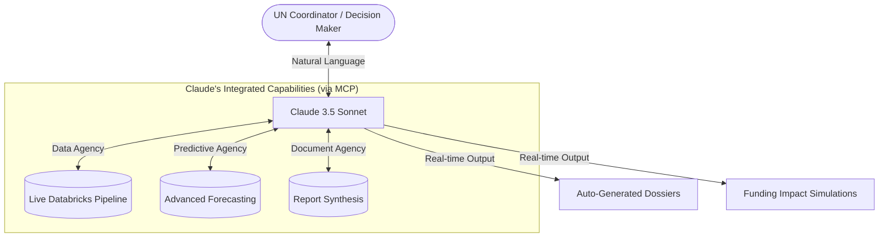

# Strategic Implementation: Claude as the Intelligence Engine for Humanitarian Efficiency

## The Core Problem: "Analysis Paralysis" in Crisis Response

The global humanitarian system is currently overburdened by a paradox: we have more data than ever before, but it often takes weeks for that data to result in life-saving funding. 

UN coordinators and donor advisors are buried under disparate reports—Financial Tracking Service (FTS) spreadsheets, Humanitarian Needs Overviews (HNO), and technical SitReps. In high-pressure environments like the Central Emergency Response Fund (CERF) allocations, this manual data aggregation creates a critical bottleneck, delaying aid to underfunded "forgotten crises."

## Claude: The "Humanitarian Brain" of Lighthouse OS

In Lighthouse OS, **Claude 3.5 Sonnet** is the central orchestration engine. It is not just a chatbot, but a sophisticated agent that bridges the gap between massive datasets and operational action. Through a custom-built **Model Context Protocol (MCP)** integration, we have empowered Claude with direct agency over our entire technical ecosystem.

## How Claude Solves the Business Challenge

By leveraging its advanced reasoning and the MCP bridge, Claude delivers three primary business outcomes that were previously impossible:

### 1. Claude as the "Zero-Latency" Analyst
Claude eliminates the manual "data grind." It has the unique ability to instantly interrogate our **Databricks** pipeline to synthesize complex severity scores and funding gaps. For a UN coordinator, this means Claude can produce a professional-grade CERF briefing memo in under 30 seconds—a task that previously took an entire team weeks of manual work.

### 2. Claude as the Auditor of Resource Allocation
Allocating millions of dollars in aid requires absolute accountability. Claude provides the **"Narrative of Need"**—automatically generating data-backed justifications for why one crisis is being prioritized over another. It doesn't just present numbers; it interprets them to explain *why* an allocation is defensible, creating a transparent audit trail for donor governments.

### 3. Claude as the Predictive Advisor
Traditional aid is reactive. Claude, however, acts as a **Predictive Advisor** by interpreting complex signals from our forecasting models. It identifies "cascading risks"—such as how underfunding in Water and Sanitation (WASH) will lead to an imminent Health crisis—allowing coordinators to shift resources proactively before a situation escalates.

## Claude and the Principle of "Data Humility"

Unlike standard AI implementations that may "hallucinate" precision, our implementation anchors Claude in a principle of **Data Humility**. 

Because Claude has a direct "live" view into data health via MCP, it is uniquely capable of recognizing its own operational blind spots. If the input data from the field is outdated or incomplete, Claude is instructed to explicitly flag this uncertainty. This ensures that humanitarian leaders are never making life-or-death decisions based on a false sense of certainty.

**Claude transforms Lighthouse OS from a tracking tool into a strategic partner, ensuring that global aid flows as fast as the intelligence that drives it.**
